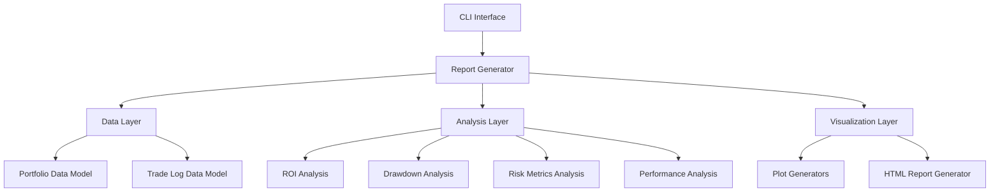

# ChatGPT Micro Cap Experiment - Refactored Report Generator

This directory contains the refactored, modular version of the ChatGPT Micro Cap Experiment report generator. The monolithic script has been restructured into a clean, maintainable architecture following Python best practices.

## Architecture

The refactored system follows a layered architecture with clear separation of concerns:



## Module Structure

```
src/
├── __init__.py
├── main.py                    # Entry point
├── cli/
│   ├── __init__.py
│   └── arguments.py          # Command-line argument parsing
├── data/
│   ├── __init__.py
│   ├── models/
│   │   ├── __init__.py
│   │   ├── portfolio.py      # Portfolio data model
│   │   └── trade_log.py      # Trade log data model
│   └── loaders/
│       ├── __init__.py
│       ├── portfolio_loader.py  # Portfolio data loading
│       └── trade_loader.py      # Trade log data loading
├── analysis/
│   ├── __init__.py
│   ├── roi_analyzer.py       # ROI calculations
│   ├── drawdown_analyzer.py  # Drawdown calculations
│   ├── risk_analyzer.py      # Risk metrics calculations
│   └── performance_analyzer.py  # Performance metrics
├── visualization/
│   ├── __init__.py
│   ├── plot_generator.py     # Plot generation functions
│   └── html_generator.py     # HTML report generation
└── utils/
    ├── __init__.py
    ├── constants.py          # Application constants
    └── helpers.py            # Utility functions
```

## Key Benefits

1. **Modularity**: Each component has a single responsibility and can be developed, tested, and maintained independently.
2. **Extensibility**: New analysis methods or visualizations can be added without modifying existing code.
3. **Testability**: Individual components can be unit tested in isolation.
4. **Maintainability**: Code is organized logically, making it easier to understand and modify.
5. **Reusability**: Components can be reused across different parts of the application.

## Usage

To run the report generator:

```bash
python3 run_report.py --date 2025-09-05
```

For more options:
```bash
python3 run_report.py --help
```

## Data Models

### Portfolio Data Model

The portfolio data model represents the structure of entries in `chatgpt_portfolio_update.csv`:

| Field | Type | Description |
|-------|------|-------------|
| Date | datetime | Date of the portfolio entry |
| Ticker | string | Stock ticker symbol |
| Shares | float | Number of shares held |
| Buy Price | float | Purchase price per share |
| Cost Basis | float | Total cost basis for the position |
| Stop Loss | float | Stop loss price threshold |
| Current Price | float | Current market price per share |
| Total Value | float | Current total value of the position |
| PnL | float | Profit and loss for the position |
| Action | string | Action taken (HOLD, SELL, etc.) |
| Cash Balance | float | Available cash balance |
| Total Equity | float | Total portfolio equity |

### Trade Log Data Model

The trade log data model represents the structure of entries in `chatgpt_trade_log.csv`:

| Field | Type | Description |
|-------|------|-------------|
| Date | datetime | Date of the trade |
| Ticker | string | Stock ticker symbol |
| Shares Bought | float | Number of shares purchased |
| Buy Price | float | Purchase price per share |
| Cost Basis | float | Total cost basis for the purchase |
| PnL | float | Profit and loss from the trade |
| Reason | string | Reason for the trade |
| Shares Sold | float | Number of shares sold |
| Sell Price | float | Sale price per share |